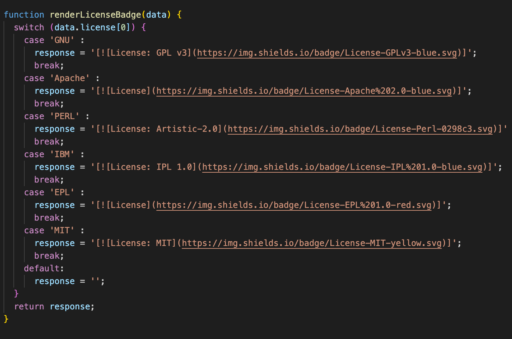
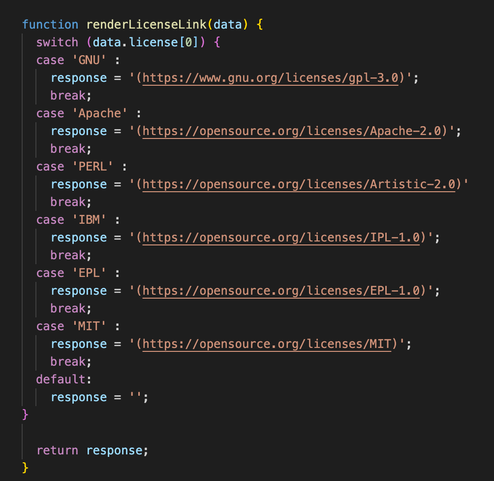
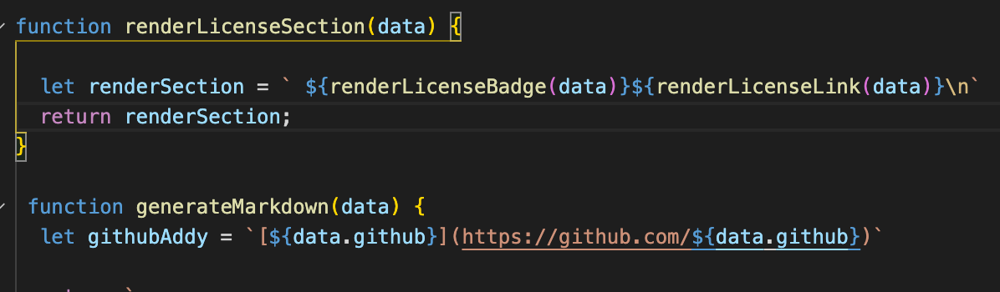
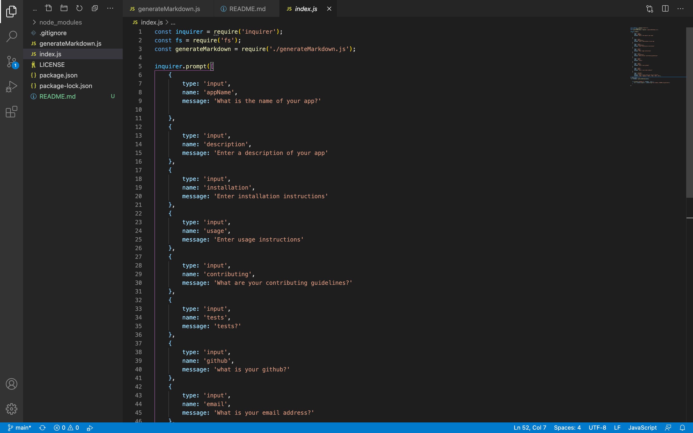
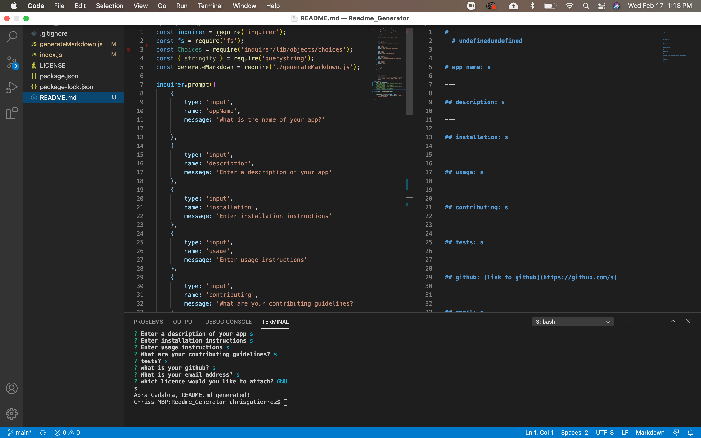

   [](https://opensource.org/licenses/MIT)


# <div align='center'> **README GENERATOR** </div>

--- 

--- 

## **Table Of Contents** 

---

1. [Description](#description)
2. [Installation](#installation)
3. [Usage](#usage)
4. [Issues](#issues)
5. [Screen Shots](#screenshot)
6. [Review and Contribute](#github)
--- 


## <div align ='center'> <a name="description"></a> **Description** </div> 

--- 

This app uses _Inquirer_ in order to generate questions that will be used in order to create a complete readme.  This will include a license badge, which has a clickable link embedded to bring you to a specific license page.  Also it includes several links to include contributors as well as links to both email and github.

--- 
 
## <div align ='center'> <a name="installation"></a> **Installation** </div>
--- 
 
1. Fork Repository
2. Clone to local Machine
3. Open a terminal window and enter `npm i` in order to download dependencies
4. From the working folder, open a terminal window
5. Input `node index.js` in order to begin script.
6. After answering all the prompts from _inquirer_ a README.md should be created in the filetree with which you ran the program.
7. Use _Marko_ or the built-in preview plug in _Visual Studio Code_ in order to marvel at your creation.
8. This will house a very nice, basic readme you can build upon with additional sections if you would like, like screen shots and links or your own creation.
--- 

## <div align ='center'> <a name="usage"></a> **Usage** </div>

--- 

To use first pull up 

--- 

## <div align ='center'> <a name="issues"></a> **Issues** </div>

--- 
```
<p>Suprisingly the issues I had were mainly due to the chaining of functions in order to use the export file.  I ran into some parameter issues, and then a particularly buggy connection involving the renderLicenseSection.  During the initial building the readme would be generated but for the badge and link, it was passing either an undefined, or an object.  As it turns out it was a combination of both.  I had to go back and make sure that I was passing the correct parameters to keep them from being returned as undefined.  Second, I had to make sure that I was accessing the switch statement correctly.  I was using the wrong object notation when trying to access the data return from the inquirer prompts.  In order to accessthe checkbox answer from the user I had to make sure to use array notation to get the first and only item in the array that was returned.  `data.license[0]` ended up being the ticket to access that return.</p>
<p>The only other issue I ran into was the use of an imported file.  With a little instruction from class I was able to figure it out relatively easily.  Now the front page looks way more readable and organized.</p>
```
--- 

## <div align ='center'> <a name="screenshot"></a> **Screen Shots** </div>

--- 

   



--- 

## <div align ='center'> <a name="github"></a> **Github and Email** </div>

--- 

## <div align ='center'> **Review and contribute here**</div>

### _Github:_ [cmgson](https://github.com/cmgson)


### _Email:_ cmgson@yahoo.com

--- 
